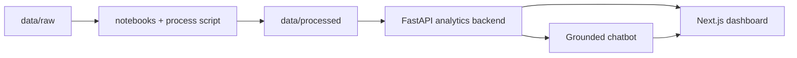

# Orbbi

Monorepo analytics-first para un dashboard y un chatbot grounded sobre una serie temporal agregada de disponibilidad observada.

La solución está pensada para demostrar criterio de AI engineering, no solo velocidad de prototipado:

- la verdad numérica vive en la capa analítica determinística,
- el chatbot interpreta y explica sin mover la base factual,
- el dashboard y el chat comparten la misma fuente de verdad,
- y el repositorio incluye calidad, seguridad y CI reales.

## Qué Encontrará Aquí

- frontend en Next.js con landing, dashboard y copiloto conversacional,
- backend en FastAPI con métricas determinísticas y chat orchestration,
- notebooks para entendimiento del dato,
- artefactos procesados en `data/processed/`,
- Docker Compose,
- Makefile,
- pruebas, cobertura, smoke tests y workflows de seguridad.



## Punto de Partida

Si va a revisar el proyecto, esta es la ruta corta recomendada:

1. Lea este `README` para correrlo y probarlo, junto a mi experiencia personal en el proceso ya que esta explica un resumen general.
2. Lea [docs/VP_REVIEW_PLAYBOOK.md](docs/VP_REVIEW_PLAYBOOK.md) para entender todo el proceso y la lógica de las decisiones.
3. Lea [docs/CHATBOT_GUIDE.md](docs/CHATBOT_GUIDE.md) si quiere profundizar en la arquitectura AI y el flujo del copiloto.
4. Lea [docs/QUALITY_AND_SECURITY.md](docs/QUALITY_AND_SECURITY.md) si quiere revisar CI, testing, coverage y seguridad.
5. Lea [docs/DATA_DICTIONARY.md](docs/DATA_DICTIONARY.md) solo si quiere la capa más técnica del dataset y sus artefactos procesados.
6. Recomiendo la Wiki para la documentación de arquitectura y distintas partes de la solución.

## Mi experiencia personal


<div align="justify">
Empecé el reto planeando toda la solución de forma muy intencional. Primero bajé ideas en Notion, donde armé gráficos, sketches y diagramas de cómo imaginaba la arquitectura, el stack, los contratos y el diseño general del producto. En esta etapa me apoyé en herramientas como Claude y Perplexity para hacer un proceso de QA de ideas, aterrizar mejor el enfoque y ayudarme a construir archivos .md muy completos que me sirvieran como hilo conductor del proyecto. Para mí esto era clave, porque quería que en todo momento los agentes, herramientas y procesos de desarrollo tuvieran contexto claro sobre el enfoque, los requerimientos y la dirección del producto. Junto con esos documentos también desarrollé un PRD, con la intención de pensar la solución como un producto real end-to-end y no solo como una prueba funcional.


Con esa base definida, construí primero el cascarón inicial del proyecto con apoyo de Claude Code, porque considero que funciona muy bien para dar ese primer paso y también para ejecutar refactorizaciones grandes. Después decidí iterar con Codex, principalmente porque me rendía mejor a nivel de tokens y porque ya contaba con un ambiente de desarrollo mucho más robusto dentro de mi CLI, con custom skills y MCPs listos para acelerar el flujo. Una vez tuve ese cascarón, pasé a una etapa que para mí era de las más importantes: el entendimiento de los datos. Antes de construir cualquier capa inteligente, quise leer los datos, analizarlos y extraer señales útiles para tomar decisiones. En ese proceso busqué outliers, tendencias y patrones de negocio que me permitieran identificar lineamientos claros, y de ahí salieron varios de los hallazgos que luego plasme en los notebooks. Ese trabajo me permitió transformar datos raw en datos processed, sentando las bases de un chatbot semántico mucho más confiable, con una parte determinística diseñada específicamente para reducir alucinaciones y dar mayor certeza, especialmente en números y consultas sensibles.

Cuando ya tenía resuelto el entendimiento y procesamiento de datos, empecé a desarrollar el backend. Para esta fase desplegué un esquema de subagentes con roles distintos: senior developer, refactorizador enfocado en calidad y simplicidad, experto en debugging, experto en arquitectura, entre otros. Para mí esto fue una decisión muy importante porque, en procesos de desarrollo amplios, tener varios subagentes coexistiendo permite trabajar en paralelo, dividir mejor el contexto, minimizar errores y asignar tareas pequeñas pero muy claras según la especialidad de cada uno. Además, como todos operaban guiados por los .md y por un contexto bien planteado, el trabajo entre ellos coexistía mucho mejor y se volvía más ordenado. Durante el backend también iteré la solución del chatbot hasta llegar a una arquitectura que considero bastante sólida: no solo se conecta con el dashboard y permite incluso crear nuevos componentes visuales, sino que además hace un uso mucho más seguro de IA gracias a su diseño por capas. La lógica parte de un orquestador de IA y un “brain”, y por debajo incorpora una capa determinística que da certeza en resultados críticos; sobre eso, para preguntas más elaboradas o menos granulares, se apoya en un system prompt robusto y en el uso del modelo de OpenAI con mi propia API key, buscando respuestas estructuradas, detalladas y alineadas con mi criterio de calidad.

Después del backend quise incorporar una práctica que para mí demuestra seriedad en ingeniería: calidad de código, CI/CD, revisión y testeo. Diseñé un pipeline con GitHub Actions, integré análisis estático con SonarQube y además sumé controles de security, dependency audits y quality/build checks. Considero que esto eleva mucho la propuesta porque muestra que no solo pensé en “que funcione”, sino en que el producto pudiera evolucionar con buenas prácticas. En una futura iteración me gustaría integrar herramientas como CodeRabbit, especializadas en revisión de código con IA, pero para este reto me pareció más sensato apostar primero por una base tradicional y robusta. También integré pruebas con Newman para evitar testeo manual de colecciones de Postman y automatizar lo máximo posible, buscando velocidad de desarrollo sin sacrificar criterio técnico. Con estas validaciones, sumadas a revisiones manuales en Swagger y a la facilidad que me daba FastAPI, pude incluso generar documentación en .md que mapea los contratos principales del backend. Adicionalmente, contemplé el uso de SQLite para el manejo de memoria de los chats y de los distintos hilos conversacionales, como una solución ligera pero efectiva para persistencia y continuidad del contexto.

Con el backend bien encaminado, pasé al frontend. Decidí estructurarlo alrededor de una marca llamada Orbbi. Elegí ese nombre porque quería transmitir la idea de “tus datos globales orbitando en un mismo sistema”, accesibles y legibles desde un solo lugar, y también porque me parecía una analogía interesante con Rappi. Como Mariana me comentó que el enfoque del reto era de libre elección, decidí tratarlo como si fuera un proyecto interno de Rappi, por eso también asumí un design system y una línea visual con cierta cercanía a su vibra de marca. Mi visión desde el principio fue que esta arquitectura no se quedara solamente en una entrega puntual, sino que pudiera convertirse en un pipeline escalable al que se le entregan datos y, a partir de ahí, genera valor mediante análisis, dashboards y un sistema agentic capaz de responder preguntas y construir información visual con pleno conocimiento del contexto. Justamente por eso mi decisión de empezar por notebooks era tan importante: desde ahí el proyecto puede pivotear con facilidad o incluso volverse más robusto en el futuro con entrenamiento de modelos, algoritmos de clasificación o predicción. En esta ocasión no lo hice porque los datos me parecieron demasiado dispersos e impredecibles para justificar un approach de ML serio en tan poco tiempo, dado su componente de aleatoriedad, pero sí me parece una línea muy interesante para iteraciones futuras y para evaluar luego su fit, train y performance real.

Para el diseño del frontend, una vez definido el concepto de Orbbi, me apoyé bastante en referentes visuales. Busqué inspiración en sitios como Awwwards, Godly y Dribbble, y también encontré un punto de apoyo importante en un proyecto de Behance que me ayudó a aterrizar mejor el tono visual y el design system. A partir de ahí combiné distintas herramientas de IA y recursos de frontend: Stitch, Claude Design, librerías como React Bits, 21st.dev, Motion y GSAPify. Todo esto lo aproveché conectando sus MCPs para que mis agentes pudieran coordinar una especie de fórmula ganadora de diseño, apoyados además por skills instaladas en Codex como ui-ux-pro-max, impeccable y taste-skill, junto con una librería amplia de recursos que podían aplicar al proyecto bajo los lineamientos que yo ya había definido previamente. Para reforzar la identidad visual también generé algunos assets con IA: entregué referencias claras de componentes y de la estética de Rappi, y a partir de eso pedí la creación de íconos, personajes, objetos y otros elementos que luego pudiera usar en efectos de parallax y animaciones con scroll usando GSAP. Para que esos resultados fueran fieles a lo que quería, utilicé un prompt enhancer que ya uso en otros proyectos personales y lo corrí con Gemini + Nano Banana. Luego hice varias iteraciones de QA de UX con Claude para mejorar flujo, composición y jerarquía visual en el frontend.

El resultado de todo ese proceso fue una identidad visual propia y un estilo que realmente me gustó, con efectos llamativos y algunas ideas más arriesgadas para evitar caer en el típico “AI slop” que hoy se ve con tanta frecuencia. Aunque todavía hay bugs y partes del frontend que me gustaría seguir refinando, considero que el producto ya es bastante funcional, creativo y diferente. Incluso siento que, con un poco más de tiempo para la entrega, podría pulirlo aún más con apoyo de un diseñador gráfico y llevarlo a un siguiente nivel visual.

En conjunto, todo este recorrido me permitió construir un producto end-to-end que cumple con lo que pedía el enunciado, pero también me permitió demostrar cómo pienso un proceso de construcción real: desde estrategia, arquitectura y entendimiento de datos, hasta calidad de código, automatización, experiencia visual y uso responsable de IA. Hacia futuro, me gustaría explorar varias mejoras: entrenamiento de modelos, contexto automático a partir de clics o secciones activas del dashboard, un chatbot semántico más cercano a un Jarvis tipo Iron Man que viva dentro del producto y no dependa tanto del prompting tradicional, interacción por voz con flujos de speech-to-text y text-to-speech para mejorar accesibilidad, mejoras en UI, modo claro para el dashboard y una evolución más fuerte de la idea de canvas plug-and-play para facilitar todavía más la construcción y refactorización de componentes.

</div>

## Requisitos

### Opción recomendada

- Docker
- Docker Compose

### Opción nativa

- Python `3.11+`
- Node.js `22`
- npm

## Configuración de Entorno

Desde la raíz del repo:

```bash
cp .env.example .env
```

Revise y ajuste al menos estas variables:

```env
APP_PORT=8418
FRONTEND_PORT=3418
NEXT_PUBLIC_API_BASE_URL=http://localhost:8418

LLM_ENABLED=true
LLM_PROVIDER=openai
OPENAI_API_KEY=su_api_key_aqui
OPENAI_MODEL=gpt-5-mini
CHAT_AUTO_LLM=true
CHAT_MEMORY_ENABLED=true
```

### Sobre `OPENAI_API_KEY`

Para probar la experiencia completa del chatbot, agregue una API key válida de OpenAI con créditos disponibles en:

```env
OPENAI_API_KEY=...
```

Sin API key el producto **sigue funcionando**, pero el chat quedará en modo más limitado:

- analítica determinística,
- sin redacción enriquecida,
- sin hipótesis,
- sin capa opcional de contexto externo.

Para una review ejecutiva conviene probarlo con key válida para que se vea el flujo completo.

## Cómo Correrlo

## Opción 1: Dockerized

Es la forma recomendada para reviewers porque reproduce el flujo más rápido y consistente.

```bash
cp .env.example .env
# agregue OPENAI_API_KEY en .env
docker compose up --build
```

Quedará disponible en:

- frontend: `http://localhost:3418`
- backend: `http://localhost:8418`
- Swagger / FastAPI docs: `http://localhost:8418/docs`

Para detenerlo:

```bash
docker compose down
```

## Opción 2: Desarrollo nativo

```bash
cp .env.example .env
python3.11 -m venv .venv
source .venv/bin/activate
make install
```

En una terminal:

```bash
make backend-dev
```

En otra terminal:

```bash
make frontend-dev
```

Luego abra:

- frontend: `http://localhost:3418`
- backend: `http://localhost:8418`
- Swagger / FastAPI docs: `http://localhost:8418/docs`

## Comandos Útiles

```bash
make install        # instala dependencias backend + frontend
make process-data   # reprocesa data/raw -> data/processed
make backend-dev    # levanta FastAPI en local
make frontend-dev   # levanta Next.js en local
make test           # corre tests backend
make coverage       # tests backend con coverage xml
make lint           # ruff sobre backend
make typecheck      # typescript check del frontend
make build          # build de Next.js
make api-smoke      # smoke tests con Newman contra backend corriendo
make docker-up      # docker compose up --build
make docker-down    # docker compose down
```

## Walkthrough Para Probar La Aplicación

Esta es la mejor secuencia para probar la solución rápido y ver los puntos importantes.

### 1. Verifique backend y contratos

Abra:

- `http://localhost:8418/health`
- `http://localhost:8418/docs`

En Swagger puede probar:

- `GET /api/v1/metrics/overview`
- `GET /api/v1/metrics/day-briefing`
- `POST /api/v1/chat/query`

### 2. Revise la home

Abra:

- `http://localhost:3418`

Ahí verá la narrativa de producto, la identidad Orbbi y el framing de solución.

### 3. Revise el dashboard

Abra:

- `http://localhost:3418/dashboard`

Qué revisar:

- KPIs del período,
- tendencia diaria,
- patrón intradiario,
- calidad del dato,
- anomalías,
- drill-down por día.

### 4. Pruebe el chatbot

Abra:

- `http://localhost:3418/chat`

Prompts recomendados:

- `¿Qué pasó el 2026-02-10?`
- `¿Qué días tuvieron la menor cobertura?`
- `Compare 2026-02-10 vs 2026-02-11.`
- `¿Cuál fue la hora con menor cobertura el 11 de febrero?`
- `Podría entregarme un gráfico que compare la cobertura total de todos los días que tenemos en febrero.`
- `Podria generarme ahora una gráfica que compare el día de menor cobertura con el promedio de los demás?`

### 5. Pruebe el flujo chat -> dashboard

En el chat:

1. genere una respuesta con artefacto visual,
2. haga clic en `Fijar en tablero`,
3. vuelva a `/dashboard`,
4. confirme que el widget aparece como módulo adicional.

Ese flujo demuestra la idea plug-and-play entre copiloto y dashboard.

### 6. Pruebe límites del sistema

Use una pregunta que el dataset no soporta:

- `Which store had the worst availability?`

Lo correcto es que el sistema rechace la granularidad inventada en lugar de alucinar.

## Qué Hace Realmente El Chatbot

El chat no responde libremente contra el raw dataset.

Flujo real:

1. recibe la pregunta,
2. `ChatBrain` detecta intención y rango temporal,
3. reutiliza memoria mínima en SQLite si aplica,
4. el orquestador ejecuta analítica determinística sobre `data/processed/`,
5. el composer arma respuesta, evidencia y artefactos,
6. y solo al final, si está habilitado, OpenAI mejora la redacción o agrega hipótesis tentativas.

Esto evita que el LLM se convierta en la fuente de verdad.

## Cómo Está Organizado El Repo

```text
ai-powered-dashboard/
├── docs/               # documentación principal
├── notebooks/          # entendimiento y validación del dato
├── data/               # raw, processed y samples
├── backend/            # FastAPI + analytics + chat orchestration
├── frontend/           # Next.js + dashboard + chat UI
└── .github/workflows/  # CI, security y quality gates
```

## Documentación Que Sí Vale La Pena Leer

Si solo va a leer pocos archivos, lea estos:

- [README.md](README.md): setup, ejecución y walkthrough.
- [docs/VP_REVIEW_PLAYBOOK.md](docs/VP_REVIEW_PLAYBOOK.md): documento principal para entender proceso, decisiones, arquitectura y respuestas a la rúbrica.
- [docs/CHATBOT_GUIDE.md](docs/CHATBOT_GUIDE.md): detalle del flujo AI y del copiloto.
- [docs/QUALITY_AND_SECURITY.md](docs/QUALITY_AND_SECURITY.md): calidad, CI, security y Sonar.
- [docs/DATA_DICTIONARY.md](docs/DATA_DICTIONARY.md): apéndice técnico del dataset y de `data/processed/`.

Con eso basta para una revisión completa del proyecto.

## Calidad y Seguridad

Este repo ya incluye:

- lint con Ruff,
- tests backend con coverage,
- tests frontend con coverage,
- typecheck,
- build,
- smoke tests con Newman,
- `pip-audit`,
- `npm audit`,
- Dependency Review,
- Github actions pipeline,
- y configuración lista para SonarQube Cloud.

## Notas Finales

- La app está **dockerizada**.
- El flujo completo funciona localmente.
- El backend lee variables desde `ai-powered-dashboard/.env`.
- Si cambia `.env`, reinicie backend o contenedores.
- Para una review completa, use una `OPENAI_API_KEY` válida con créditos disponibles.

## Próximas Iteraciones

- más tipos de artefactos visuales desde el chat,
- mejor contexto automático desde interacciones del dashboard,
- voz y experiencia tipo copiloto más embebida,
- refinamiento visual adicional,
- y expansión del canvas plug-and-play.
