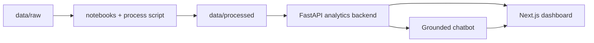

# AI-Powered Dashboard

Monorepo analytics-first para un dashboard y un chatbot grounded sobre una serie temporal agregada de disponibilidad observada.

La solución está pensada para demostrar criterio de AI engineering, no solo velocidad de prototipado:

- la verdad numérica vive en la capa analítica determinística,
- el chatbot interpreta y explica sin mover la base factual,
- el dashboard y el chat comparten la misma fuente de verdad,
- y el repositorio incluye calidad, seguridad y CI reales.

## Qué Encontrará Aquí

- frontend en Next.js con landing, dashboard y copiloto conversacional,
- backend en FastAPI con métricas determinísticas y chat orchestration,
- notebooks para entendimiento del dato,
- artefactos procesados en `data/processed/`,
- Docker Compose,
- Makefile,
- pruebas, cobertura, smoke tests y workflows de seguridad.



## Punto de Partida

Si va a revisar el proyecto, esta es la ruta corta recomendada:

1. Lea este `README` para correrlo y probarlo.
2. Lea [docs/VP_REVIEW_PLAYBOOK.md](docs/VP_REVIEW_PLAYBOOK.md) para entender todo el proceso y la lógica de las decisiones.
3. Lea [docs/CHATBOT_GUIDE.md](docs/CHATBOT_GUIDE.md) si quiere profundizar en la arquitectura AI y el flujo del copiloto.
4. Lea [docs/QUALITY_AND_SECURITY.md](docs/QUALITY_AND_SECURITY.md) si quiere revisar CI, testing, coverage y seguridad.
5. Lea [docs/DATA_DICTIONARY.md](docs/DATA_DICTIONARY.md) solo si quiere la capa más técnica del dataset y sus artefactos procesados.

Importante:

- `docs/wiki/` existe como espejo para la wiki de GitHub.
- No es la ruta principal de lectura para entender la solución.
- El documento canónico para review es [docs/VP_REVIEW_PLAYBOOK.md](docs/VP_REVIEW_PLAYBOOK.md).
- La carpeta `docs/` se redujo intencionalmente a pocos archivos canónicos para evitar ruido.

## Requisitos

### Opción recomendada

- Docker
- Docker Compose

### Opción nativa

- Python `3.11+`
- Node.js `22`
- npm

## Configuración de Entorno

Desde la raíz del repo:

```bash
cp .env.example .env
```

Revise y ajuste al menos estas variables:

```env
APP_PORT=8418
FRONTEND_PORT=3418
NEXT_PUBLIC_API_BASE_URL=http://localhost:8418

LLM_ENABLED=true
LLM_PROVIDER=openai
OPENAI_API_KEY=su_api_key_aqui
OPENAI_MODEL=gpt-5-mini
CHAT_AUTO_LLM=true
CHAT_MEMORY_ENABLED=true
```

### Sobre `OPENAI_API_KEY`

Para probar la experiencia completa del chatbot, agregue una API key válida de OpenAI con créditos disponibles en:

```env
OPENAI_API_KEY=...
```

Sin API key el producto **sigue funcionando**, pero el chat quedará en modo más limitado:

- analítica determinística,
- sin redacción enriquecida,
- sin hipótesis,
- sin capa opcional de contexto externo.

Para una review ejecutiva conviene probarlo con key válida para que se vea el flujo completo.

## Cómo Correrlo

## Opción 1: Dockerized

Es la forma recomendada para reviewers porque reproduce el flujo más rápido y consistente.

```bash
cp .env.example .env
# agregue OPENAI_API_KEY en .env
docker compose up --build
```

Quedará disponible en:

- frontend: `http://localhost:3418`
- backend: `http://localhost:8418`
- Swagger / FastAPI docs: `http://localhost:8418/docs`

Para detenerlo:

```bash
docker compose down
```

## Opción 2: Desarrollo nativo

```bash
cp .env.example .env
python3.11 -m venv .venv
source .venv/bin/activate
make install
```

En una terminal:

```bash
make backend-dev
```

En otra terminal:

```bash
make frontend-dev
```

Luego abra:

- frontend: `http://localhost:3418`
- backend: `http://localhost:8418`
- Swagger / FastAPI docs: `http://localhost:8418/docs`

## Comandos Útiles

```bash
make install        # instala dependencias backend + frontend
make process-data   # reprocesa data/raw -> data/processed
make backend-dev    # levanta FastAPI en local
make frontend-dev   # levanta Next.js en local
make test           # corre tests backend
make coverage       # tests backend con coverage xml
make lint           # ruff sobre backend
make typecheck      # typescript check del frontend
make build          # build de Next.js
make api-smoke      # smoke tests con Newman contra backend corriendo
make docker-up      # docker compose up --build
make docker-down    # docker compose down
```

## Walkthrough Para Probar La Aplicación

Esta es la mejor secuencia para probar la solución rápido y ver los puntos importantes.

### 1. Verifique backend y contratos

Abra:

- `http://localhost:8418/health`
- `http://localhost:8418/docs`

En Swagger puede probar:

- `GET /api/v1/metrics/overview`
- `GET /api/v1/metrics/day-briefing`
- `POST /api/v1/chat/query`

### 2. Revise la home

Abra:

- `http://localhost:3418`

Ahí verá la narrativa de producto, la identidad Orbbi y el framing de solución.

### 3. Revise el dashboard

Abra:

- `http://localhost:3418/dashboard`

Qué revisar:

- KPIs del período,
- tendencia diaria,
- patrón intradiario,
- calidad del dato,
- anomalías,
- drill-down por día.

### 4. Pruebe el chatbot

Abra:

- `http://localhost:3418/chat`

Prompts recomendados:

- `¿Qué pasó el 2026-02-10?`
- `¿Qué días tuvieron la menor cobertura?`
- `Compare 2026-02-10 vs 2026-02-11.`
- `¿Cuál fue la hora con menor cobertura el 11 de febrero?`
- `Podría entregarme un gráfico que compare la cobertura total de todos los días que tenemos en febrero.`
- `Podria generarme ahora una gráfica que compare el día de menor cobertura con el promedio de los demás?`

### 5. Pruebe el flujo chat -> dashboard

En el chat:

1. genere una respuesta con artefacto visual,
2. haga clic en `Fijar en tablero`,
3. vuelva a `/dashboard`,
4. confirme que el widget aparece como módulo adicional.

Ese flujo demuestra la idea plug-and-play entre copiloto y dashboard.

### 6. Pruebe límites del sistema

Use una pregunta que el dataset no soporta:

- `Which store had the worst availability?`

Lo correcto es que el sistema rechace la granularidad inventada en lugar de alucinar.

## Qué Hace Realmente El Chatbot

El chat no responde libremente contra el raw dataset.

Flujo real:

1. recibe la pregunta,
2. `ChatBrain` detecta intención y rango temporal,
3. reutiliza memoria mínima en SQLite si aplica,
4. el orquestador ejecuta analítica determinística sobre `data/processed/`,
5. el composer arma respuesta, evidencia y artefactos,
6. y solo al final, si está habilitado, OpenAI mejora la redacción o agrega hipótesis tentativas.

Esto evita que el LLM se convierta en la fuente de verdad.

## Cómo Está Organizado El Repo

```text
ai-powered-dashboard/
├── docs/               # documentación principal
├── notebooks/          # entendimiento y validación del dato
├── data/               # raw, processed y samples
├── backend/            # FastAPI + analytics + chat orchestration
├── frontend/           # Next.js + dashboard + chat UI
└── .github/workflows/  # CI, security y quality gates
```

## Documentación Que Sí Vale La Pena Leer

Si solo va a leer pocos archivos, lea estos:

- [README.md](README.md): setup, ejecución y walkthrough.
- [docs/VP_REVIEW_PLAYBOOK.md](docs/VP_REVIEW_PLAYBOOK.md): documento principal para entender proceso, decisiones, arquitectura y respuestas a la rúbrica.
- [docs/CHATBOT_GUIDE.md](docs/CHATBOT_GUIDE.md): detalle del flujo AI y del copiloto.
- [docs/QUALITY_AND_SECURITY.md](docs/QUALITY_AND_SECURITY.md): calidad, CI, security y Sonar.
- [docs/DATA_DICTIONARY.md](docs/DATA_DICTIONARY.md): apéndice técnico del dataset y de `data/processed/`.

Con eso basta para una revisión completa del proyecto.

## Si Prefiere Leer La Wiki

La wiki recomendada se lee en este orden:

1. `Home`
2. `Documentacion-Solucion`
3. `Documentacion-AI`
4. `Documentacion-Dashboard`

`Gobernanza-del-Repositorio` solo vale la pena si quiere revisar visibilidad del repo, permisos, Sonar o política de ramas.

## Calidad y Seguridad

Este repo ya incluye:

- lint con Ruff,
- tests backend con coverage,
- tests frontend con coverage,
- typecheck,
- build,
- smoke tests con Newman,
- `pip-audit`,
- `npm audit`,
- CodeQL,
- Dependency Review,
- Dependabot,
- y configuración lista para SonarQube Cloud.

## Notas Finales

- La app está **dockerizada**.
- El flujo completo funciona localmente.
- El backend lee variables desde `ai-powered-dashboard/.env`.
- Si cambia `.env`, reinicie backend o contenedores.
- Para una review completa, use una `OPENAI_API_KEY` válida con créditos disponibles.

## Próximas Iteraciones

- más tipos de artefactos visuales desde el chat,
- mejor contexto automático desde interacciones del dashboard,
- voz y experiencia tipo copiloto más embebida,
- refinamiento visual adicional,
- y expansión del canvas plug-and-play.
