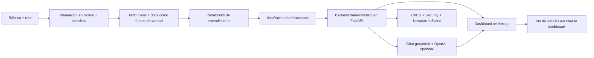
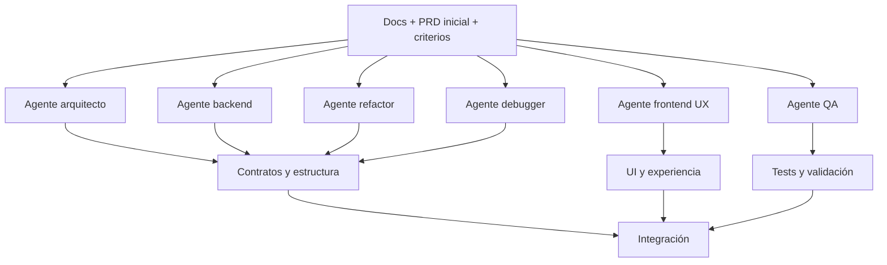
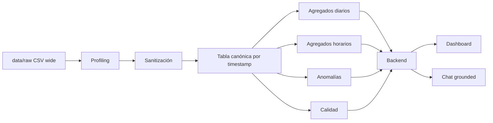
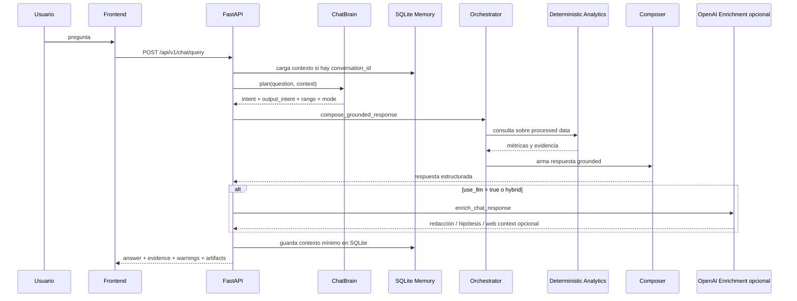
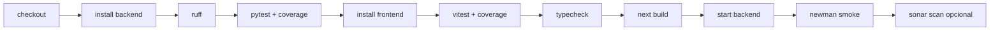

# VP Review Playbook

## Propósito

Este documento condensa el proceso real de construcción de la solución, desde la planeación hasta el producto final. Está pensado para que una persona ejecutiva o técnica pueda entender:

- qué se construyó,
- por qué se construyó así,
- cómo se usó AI de forma estratégica,
- dónde está la evidencia dentro del repositorio,
- y cuáles fueron los trade-offs reales.

Este es el documento principal para review.  
Si alguien quiere profundizar específicamente en la arquitectura del copiloto, conviene leer después [CHATBOT_GUIDE.md](CHATBOT_GUIDE.md).  
Si alguien quiere revisar calidad, CI y seguridad, conviene leer [QUALITY_AND_SECURITY.md](QUALITY_AND_SECURITY.md).

## 1. Resumen Ejecutivo

La solución entregada es un producto end-to-end llamado **Orbbi**, enfocado en convertir una exportación cruda de disponibilidad observada en:

1. un dashboard analítico claro,
2. un chatbot semántico grounded,
3. una arquitectura demostrable de AI engineering,
4. y un flujo serio de calidad, testing y CI/CD.

La decisión más importante de todo el proyecto fue esta:

> no construir una demo “bonita” sobre supuestos falsos, sino una solución fiel al dataset real.

El dato entregado no soportaba una lectura por tienda. Lo correcto fue pivotar hacia una serie temporal agregada, diseñar analítica determinística sobre esa realidad y montar encima una capa semántica conversacional segura.

## 2. Qué Se Construyó

### Producto final

El repositorio entrega una aplicación web local con:

- frontend en Next.js App Router,
- backend en FastAPI,
- notebooks de análisis y profiling,
- capa `data/processed/` reproducible,
- dashboard interactivo,
- copiloto conversacional,
- memoria conversacional liviana en SQLite,
- Docker Compose,
- Makefile,
- pruebas automáticas,
- workflows de calidad y seguridad.

### Qué hace el producto

- resume el comportamiento temporal de la métrica observada,
- expone anomalías, cobertura, calidad del dato y comparaciones,
- responde preguntas en lenguaje natural sobre el histórico,
- genera artefactos visuales compactos desde el chat,
- permite fijar esos artefactos como widgets en el dashboard,
- y rechaza preguntas que el dataset no soporta.

### Qué no hace a propósito

- no inventa una dimensión por tienda,
- no responde causalidad como si fuera verdad observada,
- no hace RAG puro sobre CSVs,
- no usa el LLM para calcular KPIs,
- no sobrepromete capacidades que el dato no justifica.

## 3. Proceso Real de Construcción

## 3.1 Planeación y contexto antes de programar

El proceso arrancó con una fase fuerte de estructuración:

- ideas y arquitectura inicial en Notion,
- sketches y diagramas para visualizar stack, contratos, flujo de datos y producto,
- QA conceptual con Claude y Perplexity para aterrizar decisiones,
- creación temprana de documentación en Markdown para fijar enfoque y restricciones,
- y un PRD inicial para convertir el reto en un producto defendible de punta a punta.

Ese material luego se condensó en pocos documentos canónicos para no dispersar la lectura del reviewer.

La intención de esta fase no fue “documentar al final”, sino usar documentación como herramienta de dirección.  
Eso le dio contexto constante a los agentes y evitó deriva durante la construcción.

### Por qué fue importante trabajar así

- redujo ambigüedad,
- permitió repartir trabajo entre agentes con reglas claras,
- ayudó a mantener consistencia entre producto, backend, frontend y AI,
- y volvió mucho más fácil justificar decisiones frente a una audiencia ejecutiva.

## 3.2 Uso de múltiples agentes y herramientas

La construcción no se hizo con una sola herramienta generando todo de forma lineal.  
La lógica fue más cercana a un sistema de trabajo coordinado:

- **Claude / Claude Code** para arrancar rápido el cascarón inicial y apoyar refactors grandes,
- **Codex** para iteración sostenida, refinamiento técnico, debugging y evolución del producto,
- **Claude y Perplexity** como apoyo de QA conceptual y contraste de decisiones,
- **MCPs y skills personalizados** en la CLI para acelerar UX, diseño, revisión técnica y acceso a tooling,
- herramientas visuales y de diseño asistido por AI para dar identidad al frontend.

### Tooling por fase

#### Planeación y dirección

- **Notion** para aterrizar ideas, arquitectura, stack y sketches.
- **Claude** para estructurar documentos iniciales y afinar narrativa.
- **Perplexity** para hacer QA conceptual y contraste rápido de decisiones.

#### Construcción y refactor

- **Claude Code** para el primer cascarón y refactors amplios.
- **Codex** para la iteración más larga: backend, frontend, bugs, tests, cobertura y refinamiento del chatbot.

#### Trabajo agentic dentro de la CLI

- uso de **custom skills** y **MCPs** para ampliar capacidades de los agentes,
- apoyo explícito de skills como `ui-ux-pro-max`, `taste-skill` e `impeccable`,
- coordinación por tareas pequeñas, con docs como fuente de verdad.

#### Diseño y UX

- **Stitch** y tooling tipo **Claude Design** para explorar dirección visual,
- referencias y recursos como **ReactBits**, **21st.dev**, **Motion**, **GSAP** y catálogos cercanos a `gsapify`,
- inspiración externa en **Awwwards**, **Godly**, **Dribbble** y el proyecto de Behance:
  <https://www.behance.net/gallery/242890057/Momentum-Branding-UX-UI-Dashboard-Design>

#### Assets visuales

- generación de imagen con prompts reforzados,
- apoyo de **Gemini** con **Nano Banana** para crear iconos, personajes y objetos,
- QA visual posterior para integrarlos a la interfaz.

### Importancia de trabajar con subagentes especializados

En un proceso amplio, usar varios subagentes coexistiendo es mejor que forzar a un solo modelo a retener todo el contexto a la vez.

Beneficios concretos:

- permite paralelizar trabajo,
- reduce errores por saturación de contexto,
- hace más fácil delegar tareas pequeñas y bien delimitadas,
- favorece roles más claros: arquitectura, backend, refactor, frontend, QA, debugging,
- y obliga a que el sistema de trabajo sea más disciplinado.

La condición para que esto funcione bien es crítica:

- cada agente debe tener un rol pequeño y concreto,
- los `.md` deben actuar como fuente de verdad,
- y cada tarea debe estar encapsulada para no generar conflicto con otras.

Ese patrón es una señal clara de AI engineering serio: no usar agentes como magia, sino como una forma controlada de organización y ejecución.

## 3.3 Cascarón inicial, luego iteración fuerte

El producto no se intentó resolver perfecto desde el primer commit.

El flujo real fue:

1. construir un primer cascarón,
2. validar rápidamente dirección,
3. profundizar notebooks y entendimiento del dato,
4. refactorizar arquitectura alrededor del dato real,
5. endurecer backend,
6. pulir AI layer,
7. montar CI, seguridad y pruebas,
8. y luego entrar al frente visual.

Ese orden fue importante: primero se aseguró la base analítica y después la capa de experiencia.

## 4. El Paso Más Importante: Entender el Dato

La decisión más valiosa del proyecto fue priorizar notebooks antes de backend y frontend.

### Por qué

La prueba hablaba de disponibilidad de tiendas, pero el dato real no se comportaba como un histórico por tienda.

Lo que había en `data/raw/` era:

- `201` archivos CSV,
- `1` fila por archivo,
- formato ancho por timestamps,
- una sola métrica observada: `synthetic_monitoring_visible_stores`,
- sin IDs de tienda, sin merchants, sin ciudad, sin segmentación.

Eso cambió por completo el enfoque de producto.

### Qué se hizo en notebooks

Los notebooks [01_data_understanding.ipynb](../notebooks/01_data_understanding.ipynb), [02_data_cleaning_and_metrics.ipynb](../notebooks/02_data_cleaning_and_metrics.ipynb) y [03_insights_and_validation.ipynb](../notebooks/03_insights_and_validation.ipynb):

- perfilaron archivos,
- validaron cadencia temporal,
- detectaron duplicados,
- identificaron ventanas truncadas,
- transformaron el raw ancho en una serie canónica,
- construyeron agregados diarios y horarios,
- extrajeron outliers, anomalías y patrones,
- y definieron qué claims eran realmente defendibles.

La lógica también quedó materializada de forma reproducible en [scripts/process_availability_data.py](../scripts/process_availability_data.py).

### Qué se descubrió

Después del procesamiento:

- quedaron `67,141` timestamps únicos,
- hubo `1,963` timestamps solapados sin conflictos de valor,
- `4` grupos de ventanas duplicadas exactas,
- `27` ventanas incompletas,
- `22,432` puntos faltantes frente al rango continuo ideal,
- cobertura estructural incompleta,
- y un patrón intradiario suficientemente fuerte como para justificar dashboard y chat.

Los artefactos resultantes en `data/processed/` son la base del producto:

- `availability_long_canonical.csv`
- `availability_window_metadata.csv`
- `availability_hourly.csv`
- `availability_daily.csv`
- `availability_hourly_anomalies.csv`
- `availability_step_changes.csv`
- `availability_quality_report.json`
- `availability_overview_summary.json`

### Qué valor dio esta fase

No solo “limpió datos”.  
Definió el producto.

Gracias a esta fase se decidió:

- no construir analítica por tienda,
- sí construir una historia temporal agregada,
- sí mostrar calidad del dato como parte central del producto,
- y sí diseñar un chatbot grounded con límites claros.

### Contrato técnico del dataset

Para que un reviewer no tenga que ir a varios archivos, aquí está la lectura técnica más importante del dato:

- `201` CSVs en `data/raw/`,
- `1` fila por archivo,
- `4` columnas de metadatos fijas,
- cientos de columnas temporales por archivo,
- una sola métrica observada: `synthetic_monitoring_visible_stores`,
- cadencia dominante de `10 segundos`,
- `67,141` timestamps únicos en la serie canónica,
- `1,963` timestamps solapados sin conflictos de valor,
- `4` grupos de ventanas duplicadas exactas,
- `27` ventanas incompletas,
- `22,432` puntos faltantes frente al rango continuo ideal.

Artefactos procesados principales:

- `availability_long_canonical.csv`
- `availability_window_metadata.csv`
- `availability_hourly.csv`
- `availability_daily.csv`
- `availability_hourly_anomalies.csv`
- `availability_step_changes.csv`
- `availability_quality_report.json`
- `availability_overview_summary.json`

Conclusión operacional:

- sí hay suficiente estructura para dashboard y chatbot,
- no hay base para una narrativa por tienda, merchant o ciudad,
- y la honestidad analítica es parte del valor del producto.

## 5. De Raw a Processed: La Base del Chat Semántico

El chatbot no nace del raw.  
Nace de una capa procesada y abstraída.

Esta capa intermedia es la razón por la que la solución puede ser:

- rápida,
- trazable,
- reusable,
- defendible,
- y menos propensa a alucinaciones.

También deja una puerta abierta importante:

- si en el futuro se quiere pivotear a ML, clasificación o predicción, la mejor base ya está en notebooks + processed layer.

### Por qué no se entrenó un modelo en esta versión

No se hizo entrenamiento de modelos porque no era la decisión más seria para este dataset y esta ventana de tiempo.

Razones:

- la serie tiene cobertura parcial,
- hay gaps estructurales,
- el histórico es corto,
- la métrica es agregada y semánticamente prudente,
- el comportamiento parece no estacionario en varios tramos,
- y el valor principal de la prueba estaba en construir criterio y producto, no en forzar un modelo predictivo débil.

En una iteración futura sí sería interesante probar:

- forecasting,
- clasificación de ventanas anómalas,
- scoring de confianza,
- o modelos híbridos para priorización operativa.

Pero hacerlo ahora habría sido menos riguroso que dejar la base bien preparada.

## 6. Backend: Arquitectura, Contratos y Orquestación

Con la base analítica lista, se construyó el backend en FastAPI.

### Estructura lógica

- `app/api/` para rutas HTTP,
- `app/services/` para casos de uso,
- `app/analytics/` para lógica determinística,
- `app/chat/` para planificación, orquestación y respuesta conversacional,
- `app/schemas/` para contratos tipados,
- `app/core/` para configuración y runtime.

### Endpoints principales

El backend expone:

- `GET /health`
- `GET /api/v1/metrics/overview`
- `GET /api/v1/metrics/daily`
- `GET /api/v1/metrics/intraday-profile`
- `GET /api/v1/metrics/anomalies`
- `GET /api/v1/metrics/quality`
- `GET /api/v1/metrics/coverage-extremes`
- `GET /api/v1/metrics/day-briefing`
- `POST /api/v1/chat/query`

Las rutas y contratos pueden verificarse en [backend/app/api/routes/metrics.py](../backend/app/api/routes/metrics.py), [backend/app/api/routes/chat.py](../backend/app/api/routes/chat.py) y [backend/app/schemas](../backend/app/schemas).

### Qué demuestra esta arquitectura

- separación clara de responsabilidades,
- reutilización de la capa analítica entre dashboard y chat,
- contratos typed,
- facilidad para testeo,
- facilidad para explicar el sistema,
- y menor riesgo de acoplar UI y lógica.

## 7. AI Architecture: Cómo Funciona Realmente el Chatbot

El chatbot fue diseñado con una regla central:

> la verdad numérica se calcula abajo; la capa AI interpreta arriba.

### Flujo real del chat

### Componentes importantes

#### `ChatBrain`

Planifica antes de ejecutar:

- detecta intención,
- detecta tipo de salida: `answer`, `chart`, `report`, `conclusions`,
- interpreta fechas y referencias,
- reutiliza contexto si aplica,
- y decide si conviene LLM o no.

#### `orchestrator`

Toma el plan y ejecuta la lógica grounded:

- llama la capa determinística,
- construye evidencia,
- genera warnings y disclaimers,
- crea artefactos visuales compactos,
- y define follow-ups.

#### `composer`

Convierte la verdad determinística en una respuesta de producto más legible sin alterar su base factual.

#### `enrichment`

Es la capa opcional que conecta con OpenAI para:

- mejorar redacción,
- separar hipótesis,
- agregar contexto externo si se habilita,
- y mantener fallback seguro si el LLM falla.

#### `memory`

La memoria conversacional se guarda en SQLite, no para hacer un chatbot “generalista”, sino para persistir:

- intent previo,
- output mode,
- ventana temporal efectiva,
- fechas referidas,
- última pregunta.

Esto permite follow-ups del estilo:

- “ahora conviértalo en conclusiones”,
- “compare ese día con el promedio de los demás”,
- “muéstrelo como gráfico”.

### Cómo se controlan las alucinaciones

Este es uno de los puntos más fuertes del proyecto.

- el modelo no calcula KPIs,
- el modelo no consulta el raw,
- los números salen de funciones determinísticas,
- el sistema rechaza granularidad no soportada,
- las hipótesis se etiquetan como tentativas,
- el contexto web es opcional y separado,
- hay respuesta fallback si el LLM falla,
- y la respuesta final siempre trae evidencia, `warnings`, `source_tables` y `disclaimer`.

### System prompt y uso del modelo

Sí existe una capa robusta de instrucciones para el modelo.  
La idea no es “dejar que improvise”, sino darle:

- una respuesta grounded ya calculada,
- un contrato de salida estructurado,
- límites explícitos,
- y reglas para no inventar números ni causalidad.

El modelo hosted se usa vía API key desde entorno, no hardcodeado en código.  
Para esta solución fue suficiente porque:

- la parte crítica ya era determinística,
- el valor del modelo estaba en redacción y superficie conversacional,
- y meter un modelo local habría agregado complejidad operativa sin una mejora proporcional.

## 8. Dashboard y Frontend: Producto, Marca y Diferenciación

Con backend y contratos estabilizados, se pasó al frontend.

### Decisión de marca

Se decidió construir la experiencia bajo la marca **Orbbi** / **OrbbiBoard**.

La idea detrás del nombre fue:

- un sistema que orbita alrededor del dato,
- acceso global y lectura clara,
- una analogía cercana al universo Rappi,
- y una vibra de producto interno tech, no de ejercicio escolar.

### Decisión visual

No se quiso caer en un frontend genérico de dashboard “AI slop”.

La búsqueda visual combinó:

- inspiración en Awwwards, Godly, Dribbble y Behance,
- un lenguaje cercano a Rappi pero con identidad propia,
- apoyo de herramientas AI de diseño como Stitch y tooling tipo Claude Design,
- uso de recursos React abiertos como ReactBits, 21st.dev, Motion, GSAP y otros catálogos visuales,
- y una coordinación fuerte entre skills, MCPs y agentes de diseño/UX.

### Assets e identidad visual

También se apoyó la UI con generación de imagen para:

- iconos,
- personajes,
- objetos,
- y elementos visuales de parallax y scroll.

Eso permitió que el producto tuviera una identidad visual más marcada y menos intercambiable.

### Enfoque de producto frente a Rappi

La consigna permitía libre elección de diseño.  
La decisión fue tratar la solución como si fuera un producto interno cercano al universo Rappi:

- serio como herramienta interna,
- con afinidad visual hacia esa vibra,
- pero sin caer en una copia superficial.

Eso explica por qué Orbbi se siente familiar dentro del ecosistema, aunque conserva identidad propia.

### Qué se hizo en frontend

El frontend se estructuró en tres experiencias principales:

- landing y narrativa de solución,
- dashboard,
- chat workspace.

La home ya deja visible el relato técnico del producto.  
El dashboard concentra lectura operativa.  
El chat funciona como copiloto analítico con narrativa propia.

### Qué hace valioso el dashboard

El dashboard no se inventa dimensiones. Se concentra en:

- KPIs agregados,
- evolución temporal,
- patrón intradiario,
- calidad del dato,
- anomalías,
- y drill-downs por día.

Además, el dashboard no es cerrado: puede recibir piezas nuevas desde el chat.

### Canvas plug-and-play

Uno de los detalles diferenciales de la solución es el patrón plug-and-play entre chat y dashboard:

- el chat devuelve artefactos estructurados,
- esos artefactos se pueden fijar,
- el frontend los persiste en `localStorage`,
- y el dashboard los incorpora como widgets adicionales.

Eso demuestra un pensamiento de producto más interesante que “chat a un lado y dashboard al otro”.

## 9. Calidad, Testing, CI/CD y Seguridad

Después de endurecer backend y chat, se dio un paso intencional hacia disciplina de ingeniería.

### Calidad base

Se integró:

- `ruff` para lint del backend,
- `pytest` con cobertura,
- `vitest` con cobertura en frontend,
- `tsc --noEmit`,
- `next build`,
- smoke tests de API con Newman,
- validación manual con Swagger / FastAPI docs.

### CI/CD

El workflow principal en [`.github/workflows/ci.yml`](../.github/workflows/ci.yml) ejecuta:

- instalación de dependencias,
- lint backend,
- pruebas backend con cobertura,
- pruebas frontend con cobertura,
- type-check frontend,
- build frontend,
- backend startup para smoke,
- y Newman para endpoints clave.

### Seguridad

La solución también incorpora:

- `pip-audit`,
- `npm audit`,
- `CodeQL`,
- `Dependency Review`,
- `Dependabot`,
- y una base lista para SonarQube Cloud.

Eso importa porque muestra algo clave:

el proyecto no se trató como una demo desechable, sino como una base de software seria.

### SonarQube / SonarCloud

Se agregó SonarQube Cloud como capa adicional de visibilidad, no como sustituto de pruebas reales.

Su rol aquí es:

- mostrar cobertura,
- calidad mantenible,
- análisis adicional,
- y percepción de madurez del repositorio.

### Por qué esto importa en una prueba

Porque demuestra:

- interés por calidad de código,
- criterio de entrega,
- seguridad básica,
- automatización,
- y capacidad de pasar de prototipo a práctica de ingeniería.

## 10. Deliverable End-to-End

La solución final no es solo una UI.

Es una cadena completa:

- entendimiento del reto,
- documentación de dirección,
- notebooks,
- datos procesados,
- backend determinístico,
- chatbot semántico,
- dashboard creativo,
- integración entre ambas superficies,
- Docker,
- tests,
- seguridad,
- CI/CD,
- y narrativa ejecutiva.

## 11. Trade-offs y decisiones maduras

### Registro corto de decisiones clave

Estas fueron las decisiones más importantes que guiaron la solución:

| Decisión | Por qué fue correcta |
| --- | --- |
| Python + FastAPI para backend | encaja con notebooks, analítica, tipado y velocidad de iteración |
| Analytics-first en vez de RAG puro | el dataset es estructurado y agregado; embeddings no resuelven la verdad numérica |
| Dashboard agregado temporal en vez de dashboard por tienda | el dato no expone granularidad por entidad |
| Raw -> processed antes de servir producto | mejora trazabilidad, consistencia y simplicidad del runtime |
| LLM solo para interpretación y redacción | reduce alucinaciones y protege la precisión |
| CI y seguridad desde temprano | convierte el proyecto en una base seria, no solo en una demo |

### Lo que se eligió hacer

- ser fiel al dato,
- construir un copiloto grounded,
- separar analítica de LLM,
- diseñar una UI fuerte sin perder rigor,
- y dejar una base escalable.

### Lo que se decidió no hacer todavía

- ML predictivo apresurado,
- RAG innecesario,
- granularidad ficticia por tienda,
- un chat generalista sin límites,
- despliegue cloud completo,
- y complejidad infra que no aportara al objetivo de la prueba.

También es importante ser honesto con lo que todavía mejoraría con más tiempo:

- algunos bugs menores de frontend,
- más polish gráfico,
- mejor refinamiento de ciertos componentes del dashboard,
- y un cierre visual todavía más fino si entrara soporte de diseño gráfico dedicado.

## 12. Qué Demuestra Este Proyecto

Este proyecto demuestra:

- criterio para leer un dataset antes de diseñar producto,
- capacidad para usar AI de manera estratégica,
- arquitectura sobria pero defendible,
- foco en grounding y control de alucinaciones,
- sensibilidad de UX y marca,
- y disciplina de ingeniería más allá de la demo.

## 13. Futuras Iteraciones

Hay una ruta clara para crecer:

- forecasting o clasificación sobre la capa procesada,
- mejor contexto automático desde clicks del dashboard,
- copiloto más embebido estilo Jarvis,
- voz con speech-to-text y text-to-speech,
- mejor integración contextual desde componentes del dashboard hacia el chat,
- modo claro del dashboard,
- más tipos de artefactos visuales,
- mejor canvas plug-and-play,
- mejor refinamiento gráfico y de layout,
- y revisión asistida de PR más especializada con herramientas tipo CodeRabbit.

## 14. Respuestas Directas a la Rúbrica

## 14.1 Uso efectivo de AI

La AI se usó de forma estratégica en varias fases, no como reemplazo del criterio:

- en planeación para estructurar el producto y los documentos base,
- en QA conceptual para contrastar decisiones,
- en scaffolding y refactor,
- en iteración técnica con agentes especializados,
- en diseño y exploración visual,
- y finalmente en la capa conversacional del producto.

Lo más importante es cómo se delimitó:

- AI para pensar, estructurar, acelerar y mejorar experiencia,
- software determinístico para calcular la verdad del dato.

Eso evita el patrón superficial de “copiar/pegar” y muestra una arquitectura donde los modelos tienen un rol claro.

## 14.2 Funcionalidad

La app funciona de punta a punta:

- el backend expone métricas y chat,
- el dashboard consume datos reales,
- el copiloto responde con grounding,
- el usuario puede generar artefactos visuales,
- y esos artefactos se pueden fijar al dashboard.

Además, el sistema sabe decir “no soportado” cuando el dataset no permite una pregunta.  
Eso también es funcionalidad valiosa porque evita claims falsos.

## 14.3 Creatividad y UX

La solución fue llevada más allá de un dashboard estándar:

- tiene identidad visual propia con Orbbi,
- una home que cuenta el sistema,
- motion y assets visuales,
- una experiencia conversacional más cercana a un copiloto premium,
- y una integración útil entre chat y dashboard.

La creatividad aquí no es maquillaje.  
Está puesta al servicio de una demo más memorable y de una experiencia de producto mejor resuelta.

## 14.4 Calidad del código

La base técnica demuestra orden y mantenibilidad:

- monorepo modular,
- backend separado por capas,
- contratos tipados,
- frontend con cliente API y stores claros,
- testing backend y frontend,
- coverage,
- CI con build y smoke tests,
- y seguridad básica automatizada.

Eso eleva el proyecto por encima de un prototipo de prueba técnica armado solo para “verse bien”.

## 14.5 Presentación

El proyecto es explicable porque se construyó con una narrativa técnica real:

- primero se entendió el dato,
- luego se definió el producto correcto,
- después se construyó backend y AI architecture,
- luego se entregó frontend y marca,
- y finalmente se endureció calidad, seguridad y CI.

Eso hace posible explicar no solo qué se hizo, sino por qué se hizo así.

## 15. Cierre

## 15.1 Secuencia recomendada de presentación

Si tuviera que presentar la solución en 5 a 7 minutos, esta es la secuencia correcta:

1. explicar que el objetivo no era solo construir una app, sino construirla fiel al dato,
2. mostrar que el dataset no soportaba una lectura por tienda,
3. contar cómo notebooks y `data/processed/` redefinieron el producto,
4. enseñar el dashboard y remarcar calidad del dato,
5. enseñar el chatbot grounded y sus guardrails,
6. mostrar el flujo `chat -> widget fijado en dashboard`,
7. cerrar con calidad de código, CI, seguridad y futuras iteraciones.

Mensaje rector:

> la solución no intenta impresionar por complejidad artificial; intenta demostrar criterio, control y producto real.

La fortaleza del proyecto no está en “usar muchas herramientas de AI”.

Está en haber usado AI con criterio:

- para pensar mejor,
- para documentar mejor,
- para iterar más rápido,
- para construir una experiencia de producto mejor,
- pero sin ceder la verdad del sistema a una capa generativa.

Ese es el mensaje que mejor representa la solución:

> no se construyó una demo apoyada en AI; se construyó un sistema donde AI y software clásico conviven con roles claros.
